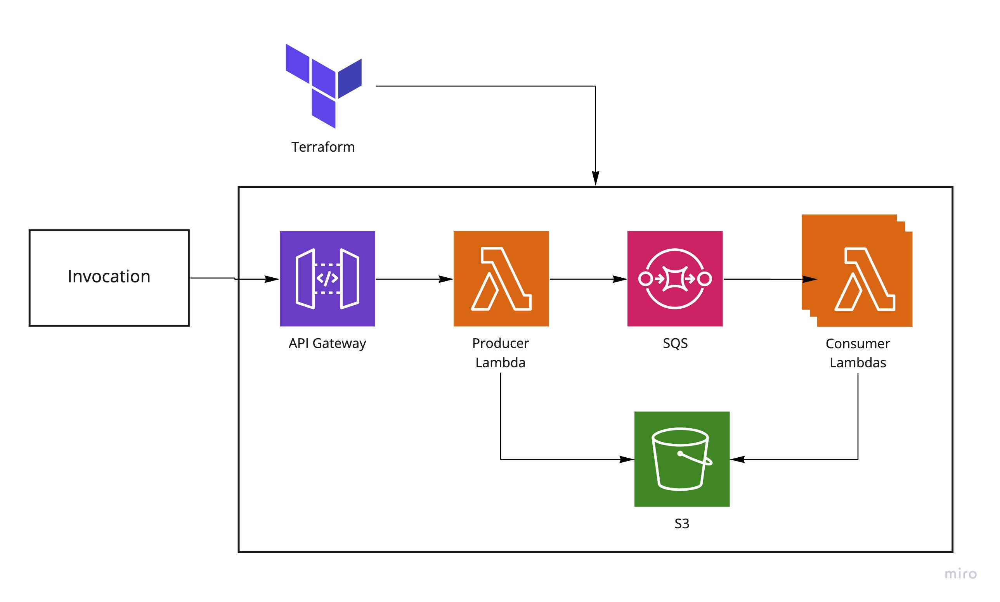

# TAS PC

_Terraform-AWS Serverless Producer-Consumer Module_.

This repository uses Terraform to automatically create a Lambda infrastructure that produces events through an API Gateway powered lambda function, stores them in an AWS SQS queue and through event sources automatically fires consumer functions.

The lambdas also have optional access to a S3 bucket that can be used to store results.

But one picture is worth a thousand words:



## How to use

1. Clone this repository
2. Adapt the variables in `vars.tf`,  or create your own `tfvars` file.
3. Adapt your code from the base of `consumer_function/` and `producer_function/` python modules. (You don't need to use python.)
3. `terraform init`
4. `terraform apply`
5. `./test.sh` to shoot a message and see it queued.

## Demo

```bash
./test.sh
```

```json
{
  "MD5OfMessageBody": "c7bb08ef48366081a55037f8e0deef97",
  "MessageId": "d48b8dc1-5e30-4681-9d48-1505f12a3740",
  "ResponseMetadata": {
    "RequestId": "82ec27b7-a468-5605-81e6-7da1ee2c2c40",
    "HTTPStatusCode": 200,
    "HTTPHeaders": {
      "x-amzn-requestid": "82ec27b7-a468-5605-81e6-7da1ee2c2c40",
      "date": "Tue, 23 Nov 2021 01:46:44 GMT",
      "content-type": "text/xml",
      "content-length": "378"
    },
    "RetryAttempts": 0
  }
}
```
